# Clown Prince - TryHackMe

---

This is a writeup for the hard-level CTF "Clown Prince" on Hack the Box. This room is located at https://tryhackme.com and is a free challenge room. I am documenting the steps necessary to compromise the machine in this writeup **WITHOUT** including any flags or spoilers (credentials, directories, etc), in the spirit of the game. However, following this process exactly should result in a full compromise of the target system.

### My usual walkthroughs are aimed at beginners, but since this is a challenge with an intentionally higher difficulty, I will not be explaining recon or enumeration, only showing the steps required to complete.

## Obviously, SPOILERS AHEAD :)

---

## First User

We can use `nxc` to check for common passwords. We find that `jerry.robinson`'s password has been reset to a default password:

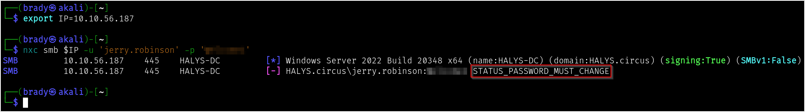

We can change this password using `impacket-changepasswd` to an arbitrary password of our choosing, provided it meets the domain complexity requirements:

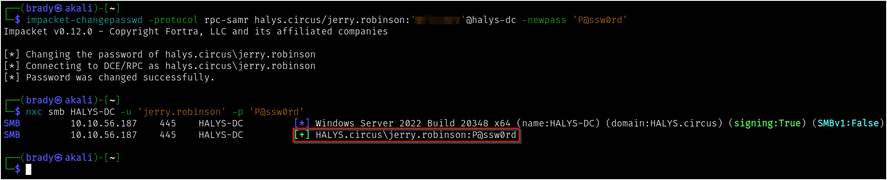

## Second User

Using `jerry.robinson`'s credentials, we can pull hashes for Kerberoastable users using `impacket-GetUserSPNs`:

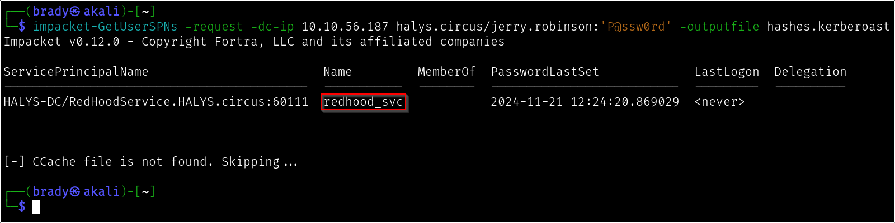

This hash does not crack with `rockyou.txt`, but will crack easily using `hashcat` mutations:

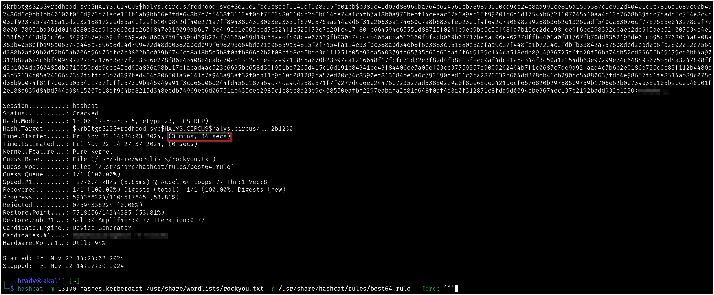

## Third User

Using `bloodhound` (legacy, in this case) we can see that our newly-compromised `redhood_svc` account can write to the `msDS-KeyCredentialLink` attribute of `bob.kane`:

We can use `pywhisker` to get a certificate for `bob.kane` using shadow credentials:

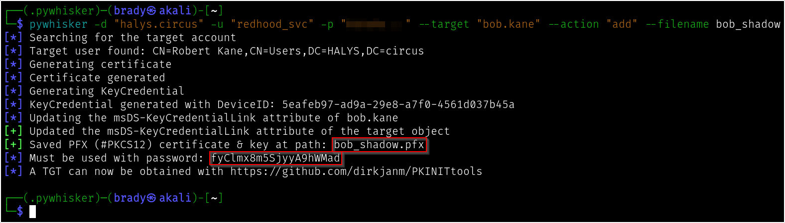

Using this certificate, we can gain a TGT for `bob.kane` using `PKINITtools\gettgtpkinit`:

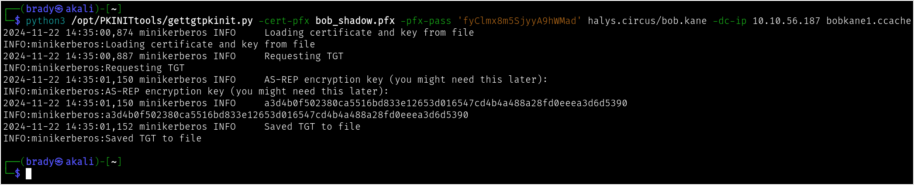

## Admin User

Typically I would have pulled `certipy-ad` as soon as I got user credentials, but for the purpose of not spoiling earlier steps, I will list that step here instead. We can see that `Domain Users` can enroll in the `Jester` template, which is vulnerable to ESC9. This will require the ability to change the UPN on an account.

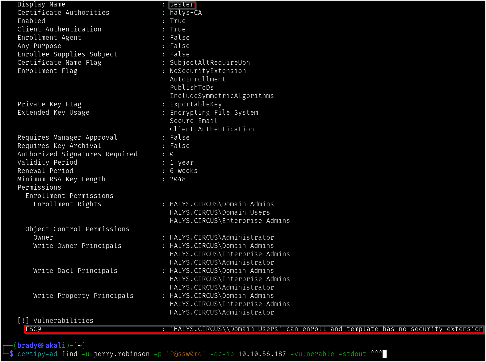

If we check `bill.finger`'s account, we will find inbound FullControl rights from the `Domain Computers` group:

This means that if we can access a domain computer account, we can use the rights over `bill.finger` to exploit ESC9. However, this domain has a restricted Machine Account Quota, so regular users are not able to create domain computer accounts.

If we check `bob.kane`'s account, we see outbound rights to add `Self` to the `Machine Account Creators` group, whose name is self-explanatory:

### ACL Abuse

Using our TGT from earlier, we can use `bloodyAD` to add the `bob.kane` user to the `Machine Account Creators` group:

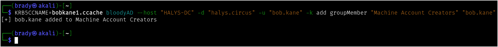

Now that `bob.kane`'s rights have changed, we will need to pull a new TGT, which we can do with `gettgtpkinit` using the same certificate as before:

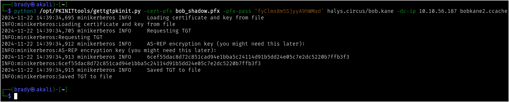

Using our new TGT, we can use `impacket-addcomputer` to add a new computer account to the domain:

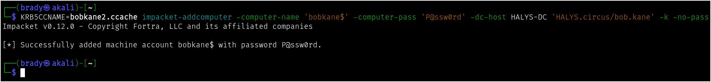

### ADCS Abuse

Now that we have credentials for an account with FullControl rights over `bill.finger`, we can use `certipy-ad` to pull a TGT (not necessarily needed in this attack chain, but typically useful) and NT hash for the `bill.finger` account using shadow credentials:

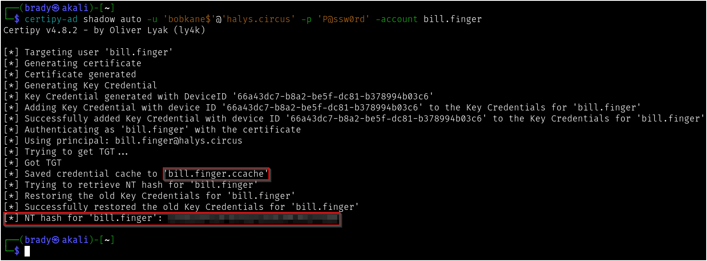

We will also use the FullControl rights to change the UPN for `bill.finger` to `Administrator`:

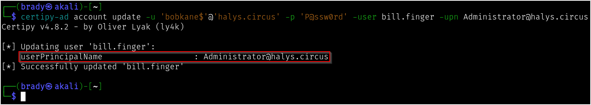

We can now use the hashes we pulled for the `bill.finger` account to request a certificate from the vulnerable `Jester` template, resulting in a certificate for the `Administrator` account:

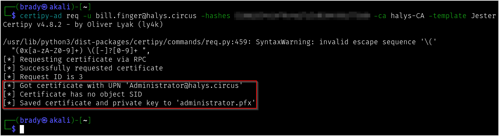

To avoid a mapping conflict, we will need to reallocate `bill.finger`'s UPN to something other than `Administrator`:

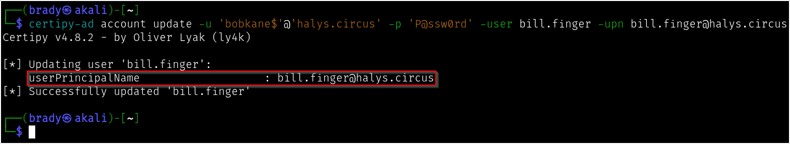

Finally, we can authenticate using the new certificate to gain a TGT and hashes for the `Administrator` account:

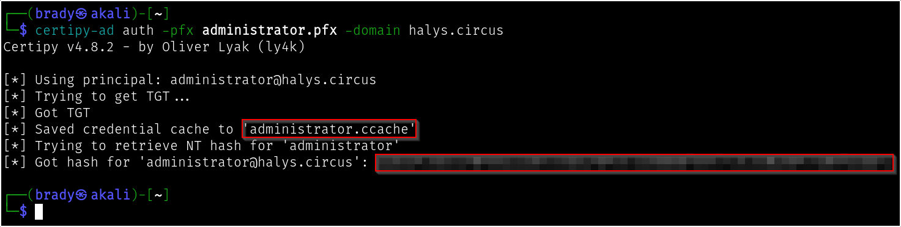

Using this TGT, we will be able to gain an interactive session as `Administrator`:

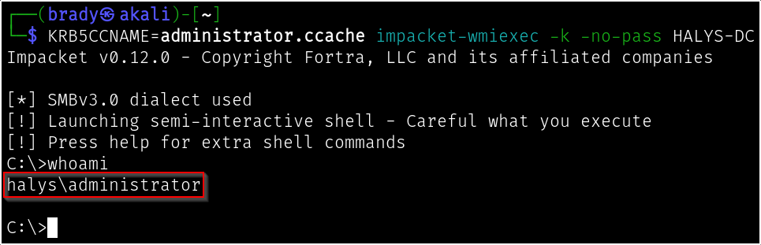

## Collecting flags

Since we have not had remote execution rights before this point, we will need to gather the flags by running the executables on each of the users' desktops:

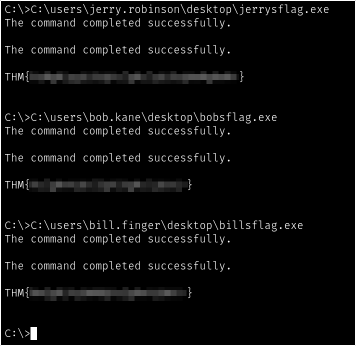

When we run the executable on the `Administrator`'s desktop, we find that the flag is being held hostage. We will need to add an account called `joker` to the `Domain Admins` group, at which point we receive new instructions:

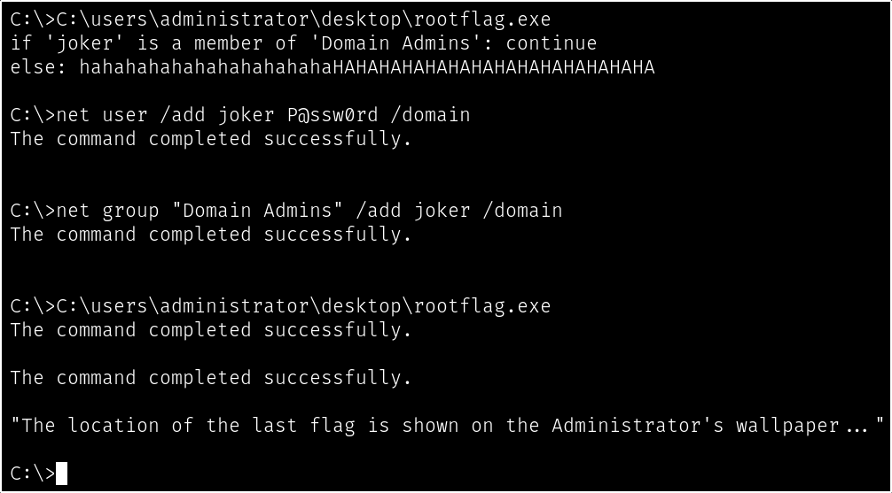

To view the Administrator's wallpaper, we will need to RDP as the `Administrator`. However, since we only have hashes and a TGT, we will need to bypass Restricted Admin mode. Luckily as the `Administrator` we can disable this remotely using registry keys:

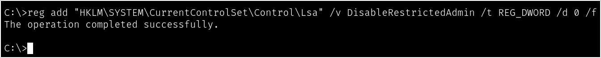

We will now be able to RDP in and see the true location of the flag:

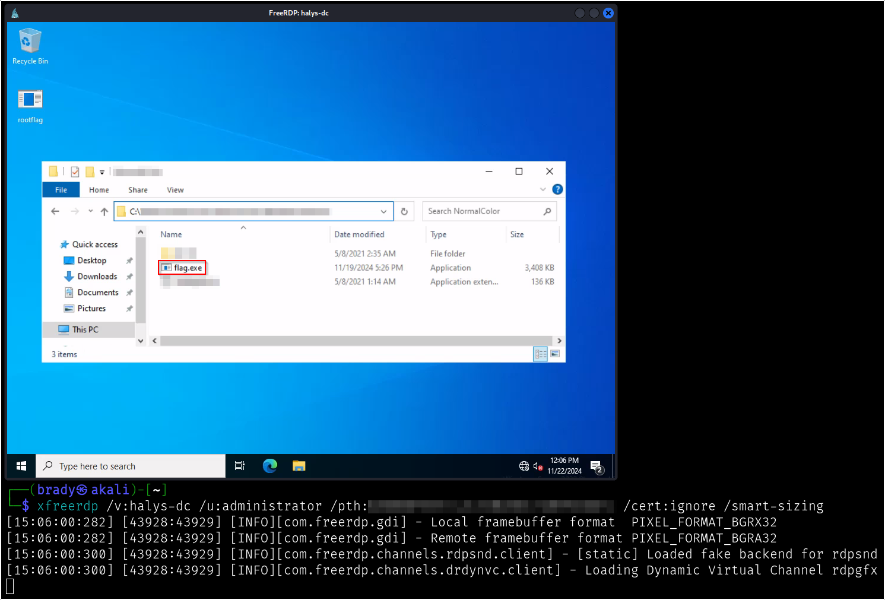

### If setwallpaper has run by the time you see the desktop, the wallpaper will been reset by TryHackMe. This can easily be fixed by right-clicking the desktop and selecting "Personalize," at which point we can select the secondmost recent wallpaper and continue.

Running this executable will give us the root flag:

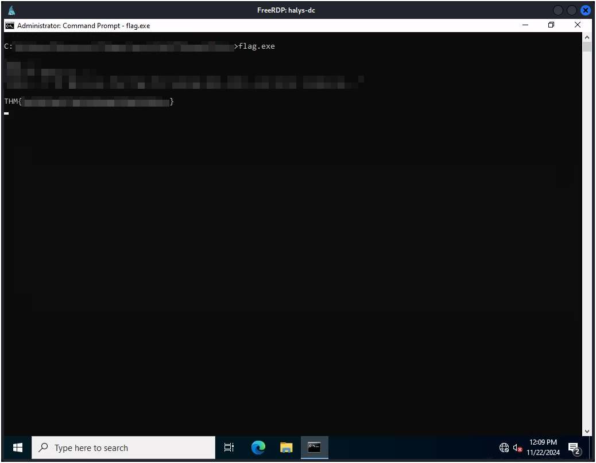

Grab it quick, before you lose control...